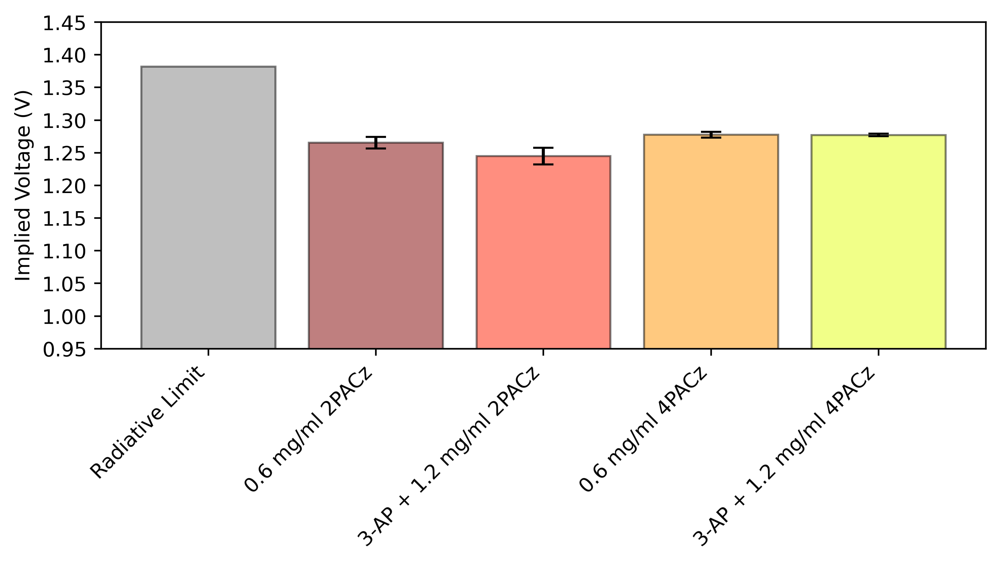

# PLQY
The code that runs the automated PLQY setup in the FRG
# PLQY analysis example
To analyze intensity dependent PLQY scans to plot implied JV curves, follow PLQY analysis Example. 
Using the Detector_Responsivity.csv, PowerCurrent_Averaged.csv, and SQ.csv, the PLQY_analysis_general.ipynb notebook will analyze the PLQY data stored in directories named after their sample numbers.  

To analyze singular PLQY scans taken at 1 sun, follow PLQY_1sun_analysis.

# Instructions for using analysis:
Edit the variable EMISSION_WL to match the peak PL emission value in nm for your sample. 
If you want to replace the sample numbers with a description of each sample, edit the sample_names_description dictionary.  
Notebook will output various figures, including injection dependent PLQY, QFLS, implied JV, and Voc values of your samples. See Demo_figures. 
